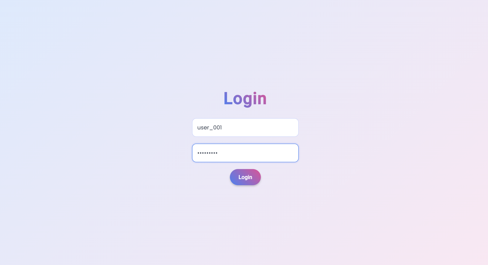
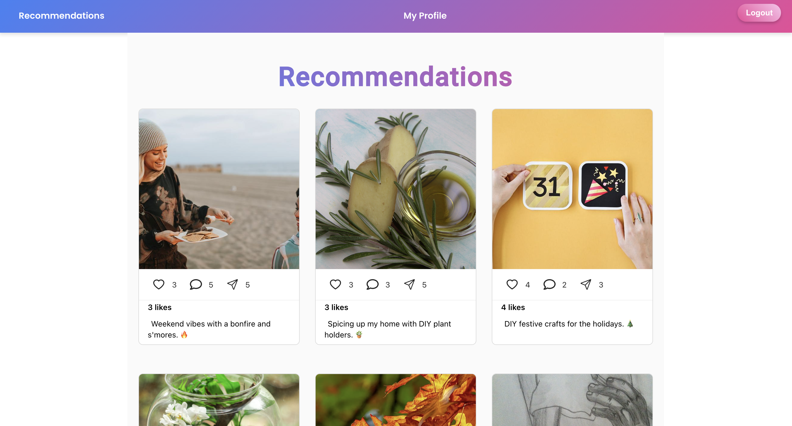
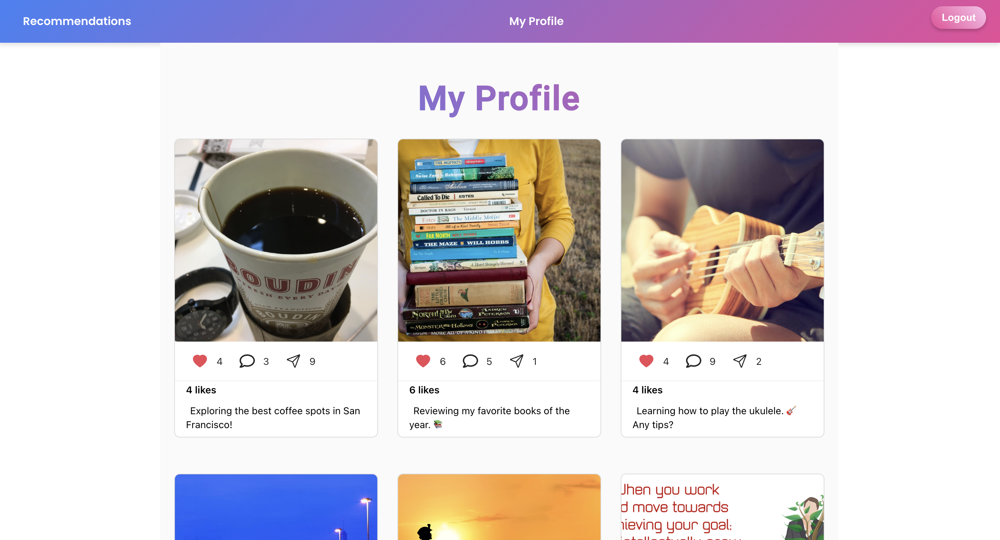
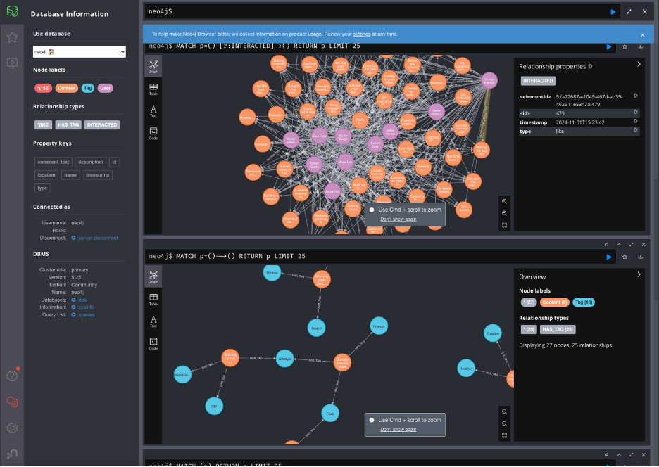
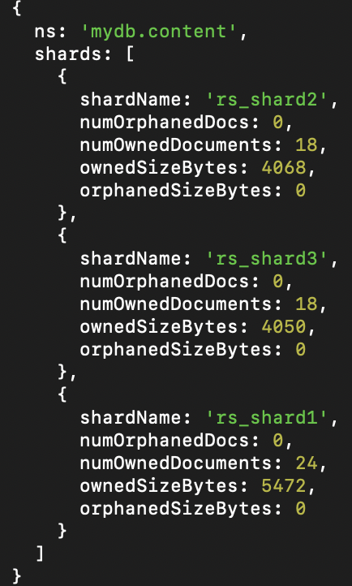

# Social Media Application

This project is a web application built with React and Node.js, featuring a
login page, two main tabs (**Recommendations** and **My Profile**), and seamless
navigation with persistent user sessions.

---

# Features

- **Login System**: Users can log in with a username and navigate between tabs
  after authentication.
- **Recommendations Tab**: Displays personalized recommendations for the
  logged-in user.
- **My Profile Tab**: Shows posts created by user.
- **Logout Functionality**: Securely logs the user out and redirects to the
  login page.
- **Persistent Sessions**: The logged-in state is maintained using
  `localStorage` across routes.
- **Responsive Design**: Styled with modern CSS, using gradients and consistent
  typography.
- **Error Handling**: Displays user-friendly error messages for invalid login
  credentials or other potential issues.
- **Node.js Backend**: Handles user authentication and data storage
- **Distributed Architecture**: Utilizes a MongoDB sharding setup for scalable
  data storage, replication for fault tolerance and Neo4j for graph database
  operations.

---

## MongoDB Sharded Cluster with Docker Compose

This project sets up a MongoDB sharded cluster using Docker Compose. It
includes:

- A **config server replica set** (`rs_config`) for metadata management.
- Three **shards**, each configured as a replica set (`rs_shard1`, `rs_shard2`,
  `rs_shard3`).
- A **mongos router** to coordinate queries across the shards.

---

## Neo4j

This project uses Neo4j for graph database operations. It includes:

- **Neo4j Docker Image**: Runs Neo4j in a Docker container.
- **Cypher Queries**: Utilizes Cypher, the query language for Neo4j, to fetch
  posts using collaborative filtering and ranking system.

---

# Setup process

## Docker setup

- Follow instructions in `/docs/walkthrough.docx`

## Code Setup

- Clone the repository.

```bash
git clone https://github.com/deeprodge/Distributed-Content-Rec-engine.git
```

- Navigate to the project directory.
- Install dependencies.
- Open two terminals , one for the frontend and one for the backend
- Run the following commands in the frontend terminal

```bash
cd frontend
npm start
```

- Run the following commands in the backend terminal

```bash
cd backend
node server.js
```

# Web Pages





# Database

 
